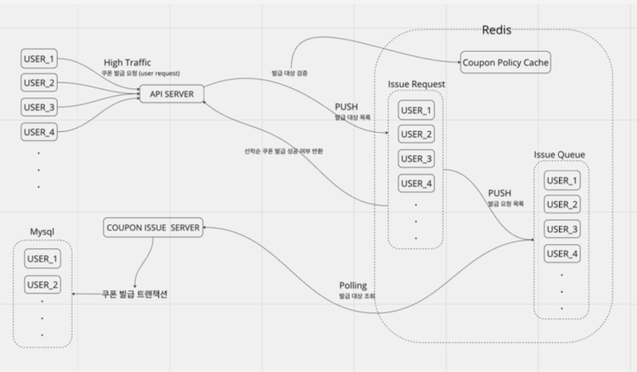

# FirstGrab

## 프로젝트 개요
유저에게 선착순으로 쿠폰을 발급 하고 api 서버를 모니터링 해보자

## 기술 스택
- **JDK**: OpenJDK 17
- **Framework**: Spring Boot 3.1.5
- **Database**: MySQL 8.0
- **Caching**: Redis 7
- **Test**: Locust

## 아키텍처

## 주요 기능

- **쿠폰 동시발급에 대한 동시성 문제 해결**:
  - Synchronized
  - Redis lock
  - MySQL lock
  
- **부하테스트**
  - 테스트를 통한 병목 식별

- **성능개선**
  - 캐싱을 통한 성능 개선

- **모니터링**
  - grafana 와 promethus를 통한 모니터링
